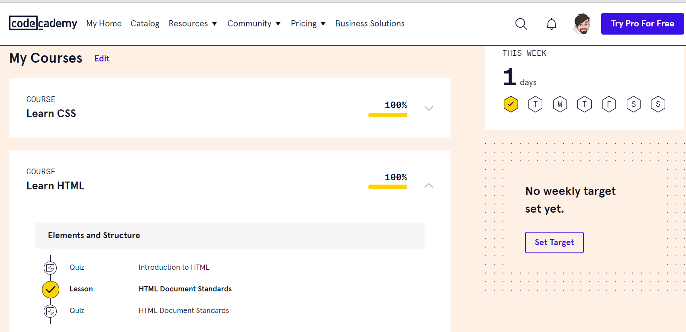
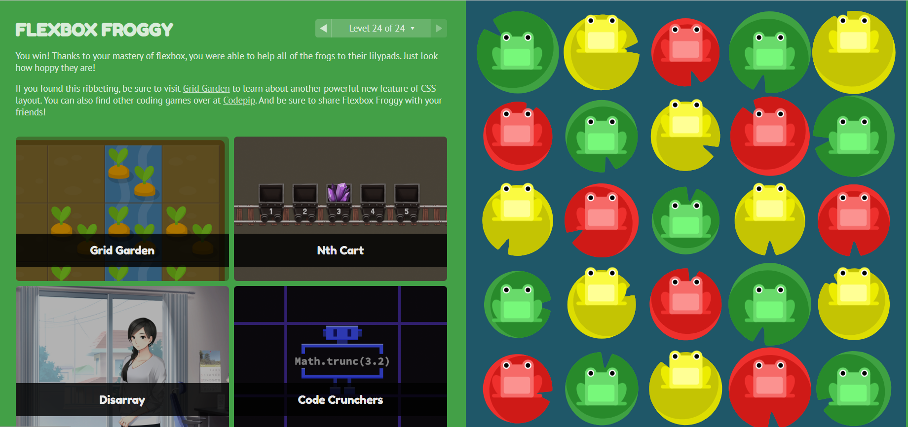
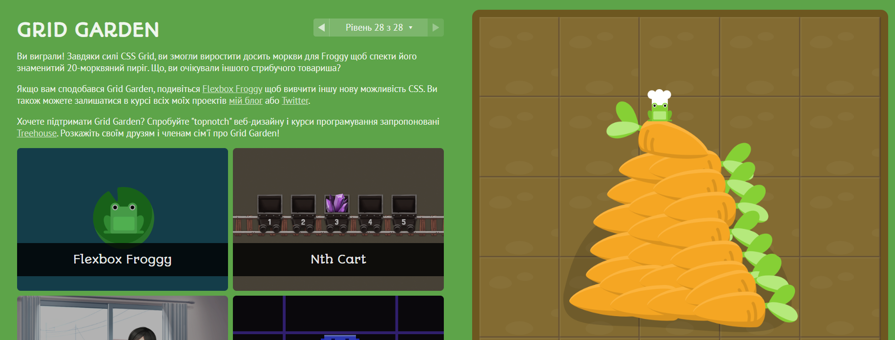
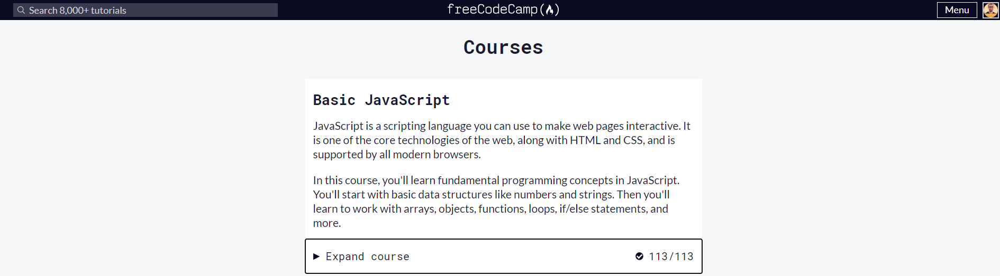
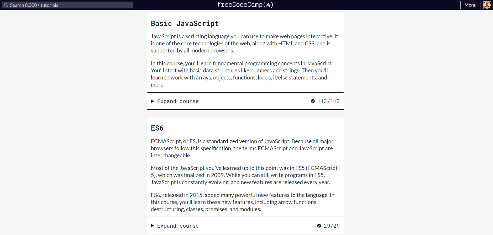
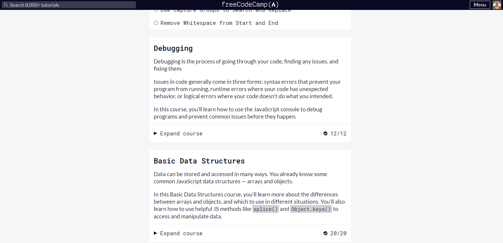

# Stage 0. Self-Study Kottans 2022

## General

- [x] Git Basics
- [x] Linux CLI and Networking
- [x] VCS (hello gitty), GitHub and Collaboration
  
## Front-End Basics
- [x] Intro to HTML & CSS
- [x] Responsive Web Design
- [x] HTML & CSS Practice
- [x] JavaScript Basics
- [ ] Document Object Model - practice
___

## Progress

0. Git Basics

Hi all!
I try to write in English for practice, so I think you will be not strict for me if you find mistakes. In this course I learned new instruments for organize work on the future projects. This educational task gave me knowing about Git and GitHub and their power. With Git and GitHub we can make new parts of the project and don’t care about lose our progress even if my personal computer hard drive will be lost. Because all the working data stay on the remote repository, and I can continue my work on any new machine or from any place of the world (of course if I have an internet connection:))

>1.Introduction to Git and GitHub:

>2. Sequence, Push & Pull (learngitbranching.js.org) :

1. Linux CLI and Networking

Before now, I used already some commands in command line, but now I learned more of them and understand how I can make some things faster on work project. This commands was new for me "rmdir", "mkdir", "../".  Now I will use "../"  command more often.

>1.Linux Survival (4 modules):

>2. HTTP: Протокол, який повинен розуміти кожний веб-розробник - Частина 1:

In this article about HTTP I took some interesting information for me.  New for me was a understanding of what is URL address more detailed then I known before. Very important for me was a what these means inner text  content in URL address.
Good thing - know about all methods of request to server.
I think need to try to use another methods of request to server then POST, GET.

>3. HTTP: Протокол, який повинен розуміти кожний веб-розробник - Частина 2:

After reading this part of article,  new for me was - difference of HTTP and HTTPS connects.
Caching - this one of themes which need to learn more deeper.

2. VCS (hello gitty), GitHub and Collaboration

* New - is work with comments on GitHub. I need to practice it. 
* Also good idea  is to make more deep describes in commits. 

>1. Introduction to Git and GitHub (3 and 4 weeks):

>2. Основи: Їдемо далі, Переміщуємо роботу туди-сюди (learngitbranching.js.org):

    * This very important to know how to use commits cancelation.
    * New is interactive rebase in git.

>3. Віддалені репозиторії: Через origin – до зірок. Прогресивне використання Git Remotes:

* Should make a short list of git commands for myself help.

3. Intro to HTML & CSS :

>1.Intro to HTML & CSS ( Coursera ):

    * new is understanding of how to make SPA with JS and JQuery
    * in the future I want to practice a make SPA with JS and Bootstrap

>2.Learn HTML & CSS ( https://www.codecademy.com/ ) :

    * I learned new how to include the font in the project

4.Responsive Web Design :

>1.Responsive web design basics (READ):

    * new: use any-hover, any-pointer,  Multicol 
    * I was surprised: to enable older browsers to correctly parse attributes, use a comma to separate attributes in meta tag.
    * need to use: try a grid layout in CSS

>2.FLEXBOX. Вчимося верстати на флексах:

    * new is to use flexbox for put footer to bottom when content area is not full.
    * beafore I use don’t think about use flexbox in all project, only sometime if I need to centered elements.
    * need to implement all power of flexbox in future projects 

>3.Flexbox Froggy - гра для закріплення:

>4.CSS Grid Layout

    * new is grid system, don’t use it before
    * surprised flexibility of grids

>5.Grid Garden - гра для закріплення

5.HTML & CSS Practice

>Practice:
https://sinchuk.github.io/HTML-CSS-Popup/

6. JavaScript Basics

>1.Basic JavaScript :
<ul>
    <li>new is use multiple conditional (ternary) operators, iterate with JS Loops, use recursion </li>
    <li> I wondered how many methods and instruments JS have for work </li>
    <li> I think in free time need to learn about recursion deeper </li>
</ul>

>2.ES6 Challenges :
<ul>
    <li>Es6 it`s for make work easy. New was is use import/export for reuse JS code.</li>
    <li>I liked to use destructuring the object and spread operators</li>
    <li>Sure for good understanding new features in ES6 need to understand old possibilities of base JS language.  </li>
</ul>

>3.Basic Data Structures :
<ul>
    <li>new is understanding difference of array and object and them methods</li>
    <li>very helpful is Object.keys() methods for work with object keys.</li>
    <li>need some practice to understand witch methods JS need to use in different situations.</li>
</ul>

  
>4.Basic Algorithm Scripting :
<ul>
    <li>algorithms can be difficult, but main way to construct good one need to know with witch small parts to build them.</li>
    <li> need to practice algorithm thinking.</li>
</ul>

>5.Functional Programming :    

<ul>
    <li>new is .map() and .filter() methods</li>
    <li>how some methods give a possibility to write short and clean code</li>
    <li>In future projects, I want to use .filter() and .map() methods more often instead of JS loops if it's better.</li>
</ul>

   

>7.Algorithm Scripting Challenges  : 
<ul>
    <li>new Set() method is very interest for make code shorten</li>
    <li>different ways to solve one task</li>
    <li>need to learn how to solve task with much better way and when take a new knowledge refactor the old code for make him shorten and clean.</li>
</ul>   

   

