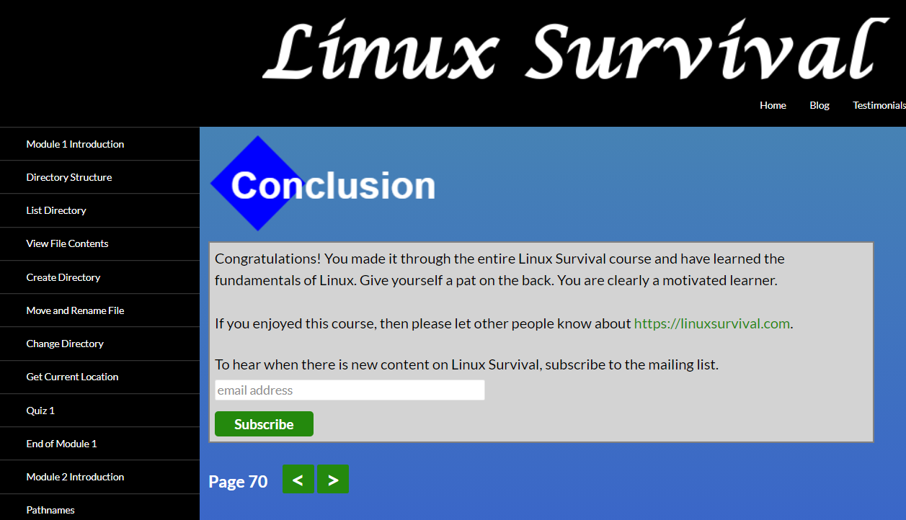
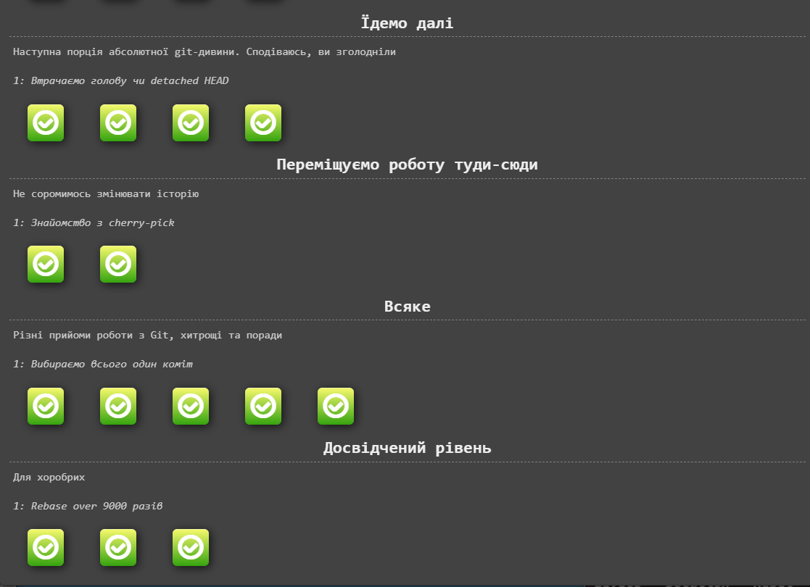
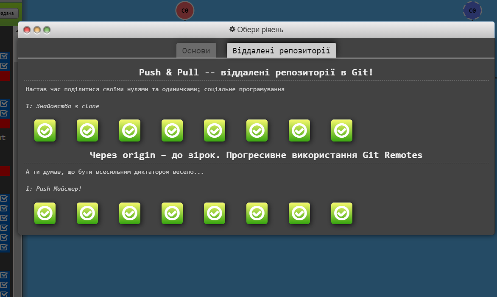

# Stage 0. Self-Study Kottans 2022

## General

- [x] Git Basics
- [x] Linux CLI and Networking
- [x] VCS (hello gitty), GitHub and Collaboration

___

## Progress

0. Git Basics

Hi all!
I try to write in English for practice, so I think you will be not strict for me if you find mistakes. In this course I learned new instruments for organize work on the future projects. This educational task gave me knowing about Git and GitHub and their power. With Git and GitHub we can make new parts of the project and don’t care about lose our progress even if my personal computer hard drive will be lost. Because all the working data stay on the remote repository, and I can continue my work on any new machine or from any place of the world (of course if I have an internet connection:))

>1.Introduction to Git and GitHub:

>2. Sequence, Push & Pull (learngitbranching.js.org) :

1. Linux CLI and Networking

Before now, I used already some commands in command line, but now I learned more of them and understand how I can make some things faster on work project. This commands was new for me "rmdir", "mkdir", "../".  Now I will use "../"  command more often.

>1.Linux Survival (4 modules):

>2. HTTP: Протокол, який повинен розуміти кожний веб-розробник - Частина 2:

In this article about HTTP I took some interesting information for me.  New for me was a understanding of what is URL address more detailed then I known before. Very important for me was a what these means inner text  content in URL address.
Good thing - know about all methods of request to server.
I think need to try to use another methods of request to server then POST, GET.

2. VCS (hello gitty), GitHub and Collaboration

New - is work with comments on GitHub. I need to practice it. Also good idea  is to make more deep describes in commits. 

>1. Introduction to Git and GitHub (3 and 4 weeks):

>2. Основи: Їдемо далі, Переміщуємо роботу туди-сюди (learngitbranching.js.org):

    * This very important to know how to use commits cancelation.
    * New is interactive rebase in git.

>3. Віддалені репозиторії: Через origin – до зірок. Прогресивне використання Git Remotes:

* Should make a short list of git commands for myself help.

